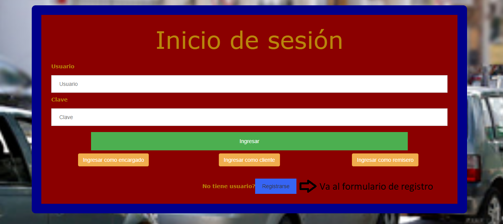
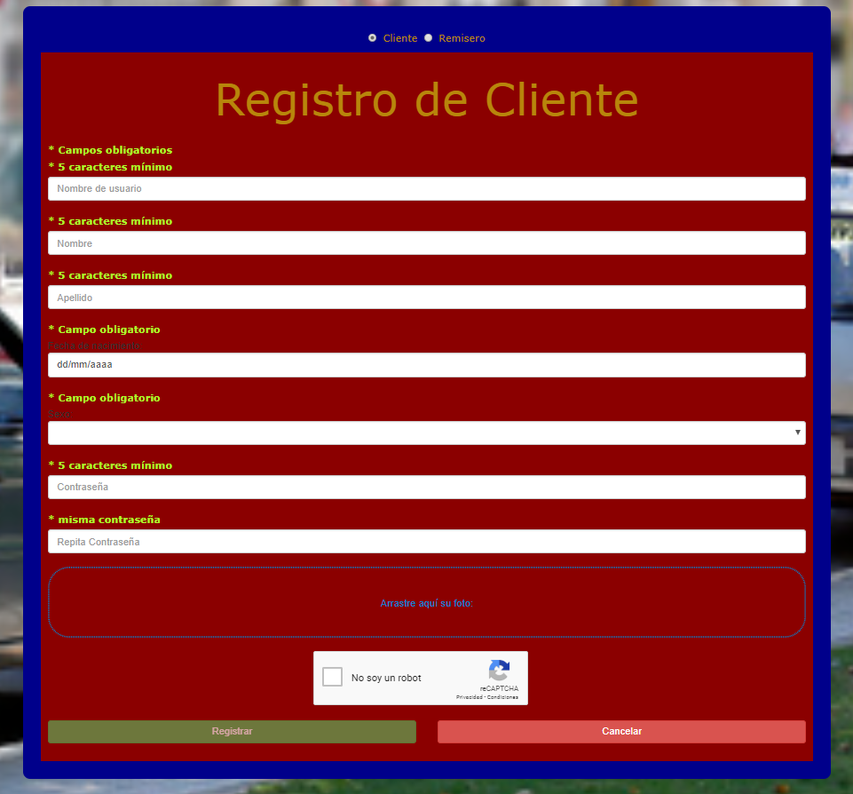
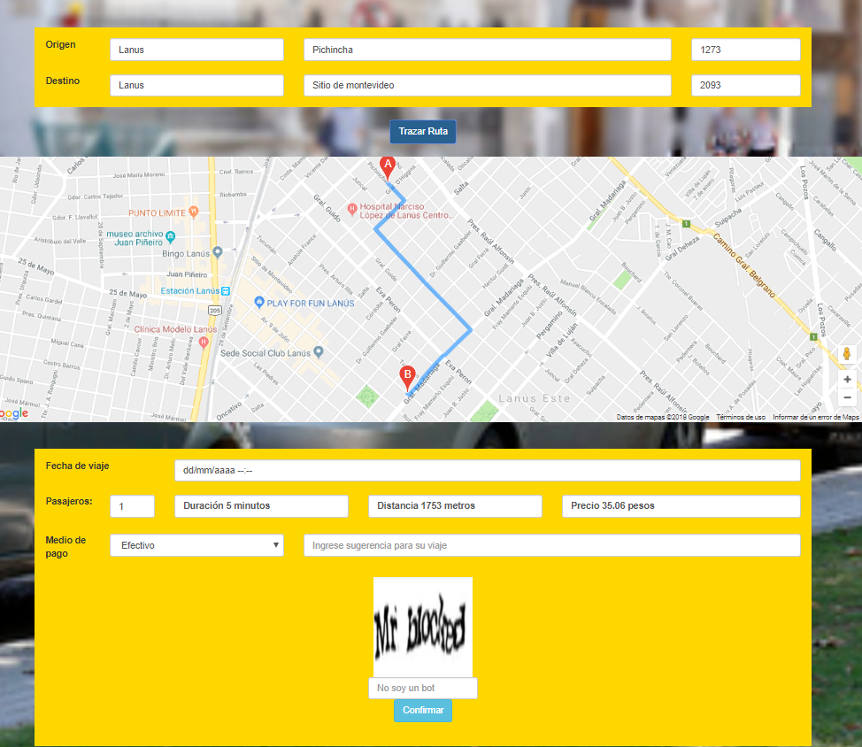
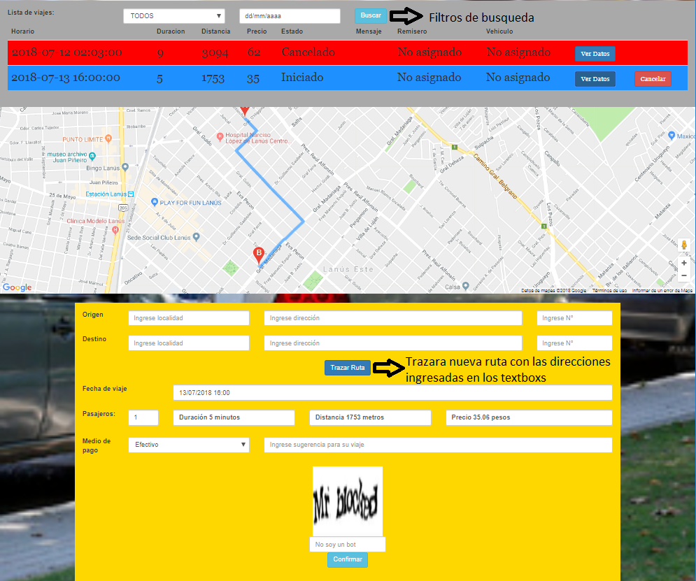
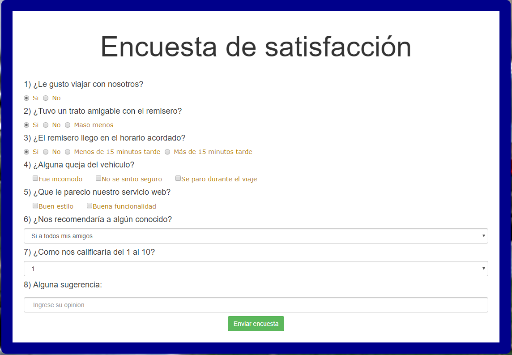

# TP Final Remisería de [Rodrigo Balabasquer](http://rodrigobalabasquer.esy.es/)

El trabajo práctico consiste en una página web que se engarga de gestionar una Remisería, la cual tiene un formulario de inicio de sesión y de registro de usuario. Los usuarios se dividen en 3 categorías: el encargado, el remisero y el cliente, de este último mostrare explicare como funciona la página.

# Ayuda para el cliente:
1) El usuario debera iniciar sesión con su nombre de usuario o caso de que no tenga registrarse, para eso usara los formularios de inicio de sesión y registro.

2) Luego si los datos son correctos se habilitara un menú principal con 3 opciones para el cliente:  

  1)Pedir un viaje: Donde el cliente ingresara la dirección de origen y de destino (ingresando localidad, calle, y N°) y hara click en el boton "trazar ruta", el cual mostrara la ruta del viaje junto con la distancia, duración y precio del viaje. El cliente tendra la libertad de elegir la cantidad de pasajeros, metodo de pago, día y hora del viaje y también alguna comodidad que desea, tendra que resolver un captcha para comprobar que no es un bot y finalmente confirmar el viaje.
 
  2)Acceso a su viaje: el cliente podra ver todos sus viajes incluyendo los que fueron cancelados, los que fueron finalizados, los que todavía no fueron vistos por el encargado y los que ya tienen un remisero asignado para dicha fecha, también dispondra de un filtro por estado del viaje y por día programado del viaje. El cliente podra cancelar los viajes que no hayan finalizados y si el viaje todavía no tiene un remisero asiganado podra ser editado, solo tendra que clickear el boton ver datos, modificar los datos (incluyendo las direcciones), resolver el captcha y confirmar los cambios.
   
  3)Encuesta: por último el cliente tiene la posibilidad de realizar una encuesta de satisfacción y de dejar alguna sugerencia, sin embargo solo la podra realizar una ver.
  
